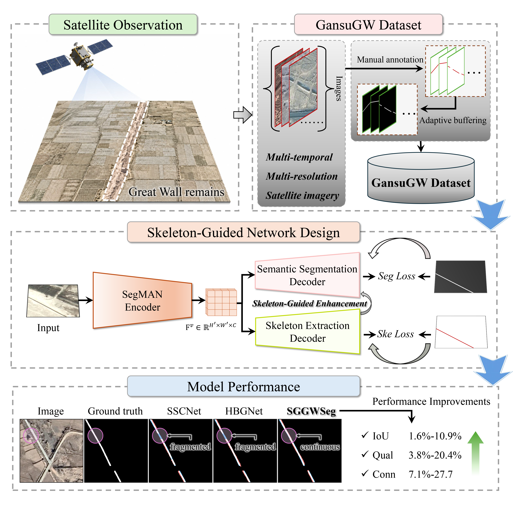
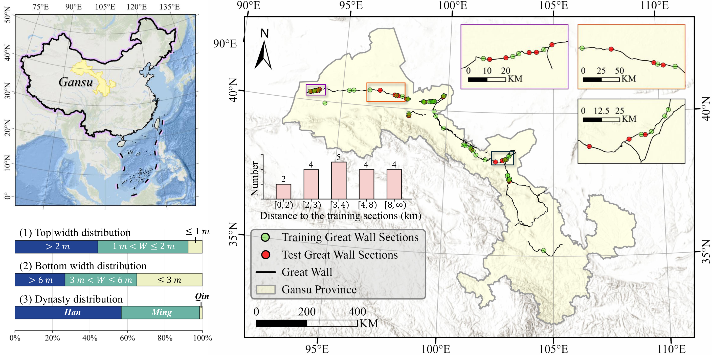

<h1 align="center">SGGWSeg</h1>

<h3 align="center">
  <em>Tracing the Great Wall from Satellite Imagery: A Skeleton-Guided Dual-Task Framework for Linear Remains Extraction</em>
</h3>

<p align="center">
  <a href="#introduction">Introduction</a> ·
  <a href="#news">News</a> ·
  <a href="#graphical-abstract">Graphical Abstract</a> ·
  <a href="#methodology">Methodology</a> ·
  <a href="#installation">Installation</a> ·
  <a href="#dataset">Dataset</a> ·
  <a href="#downloads">Downloads</a> ·
  <a href="#citation">Citation</a>
</p>

<a id="introduction"></a>

## Introduction

This is the official implementation of **SGGWSeg**, a novel skeleton-guided dual-task collaborative framework for high-resolution remote sensing linear cultural remains extraction (e.g., the Great Wall). SGGWSeg jointly optimizes semantic segmentation and skeleton representation learning through a dual-task strategy, enhancing the continuity and completeness of extracted linear remains, especially for narrow and fragmented structures in complex environments.

<a id="news"></a>

## 📌 News

- **[2026/08/23]** The code of SGGWSeg is available.
- **[2026/07/26]** Based on our SGGWSeg, our project has won the **Gold Award** in the **AI for Science** track of the [3rd Global Digital Intelligence Education Innovation Competition](https://diidea.pku.edu.cn/competition2026/). Congratulations!
- **[2026/06/11]** Our paper has been prepared for submission to *ISPRS Journal of Photogrammetry and Remote Sensing*.
- **[Coming soon]** The GansuGW dataset and pre-built environment packages will be released via Baidu Netdisk.

<a id="graphical-abstract"></a>

## 🖼️ Graphical Abstract

<p align="center">
  
</p>

The graphical abstract summarizes satellite observation, the construction of the multi-temporal and multi-resolution GansuGW dataset, the skeleton-guided dual-task network, and its improvements in the continuity and completeness of remains extraction.

<a id="methodology"></a>

## 🏗️ Methodology

<p align="center">
  
</p>

Here is the overall architecture of our proposed **SGGWSeg** framework. SGGWSeg adopts a SegMAN-S encoder and two collaborative branches for remains semantic segmentation and skeleton extraction. Multi-level features are aggregated by the multi-scale context aggregation module, while skeleton-guided enhancement injects linear structural cues into the semantic branch. The two tasks are optimized jointly with segmentation and skeleton supervision.

<a id="installation"></a>

### Environment Installation

#### 1. Create the environment

```bash
conda create -n sggwseg python=3.9 -y
conda activate sggwseg
python -m pip install --upgrade pip setuptools wheel
```

#### 2. Install PyTorch

```bash
python -m pip install \
  torch==2.1.0+cu118 \
  torchvision==0.16.0+cu118 \
  torchaudio==2.1.0+cu118 \
  --index-url https://download.pytorch.org/whl/cu118
```

#### 3. Install Python dependencies

```bash
python -m pip install -r requirements.txt
```

#### 4. Install the compatible wheels

Install the provided wheels with `--no-deps` to prevent pip from replacing the matching PyTorch build.

```bash
python -m pip install --no-deps \
  wheels/GDAL-3.4.3-cp39-cp39-manylinux_2_17_x86_64.manylinux2014_x86_64.whl

python -m pip install --no-deps \
  wheels/natten-0.17.3+torch210cu118-cp39-cp39-linux_x86_64.whl

python -m pip install --no-deps \
  wheels/mamba_ssm-2.2.4+cu11torch2.1cxx11abiFALSE-cp39-cp39-linux_x86_64.whl

python -m pip install --no-deps mmcv-lite==2.1.0
```

### Code Entry Points

| Stage | File | Purpose |
|---|---|---|
| Data preparation | [`data_processing/data_preprocessing.py`](data_processing/data_preprocessing.py) | Split source rasters and extract paired image/label patches. |
| Training | [`train.py`](train.py) | Train SGGWSeg and save checkpoints and TensorBoard logs. |
| Validation and testing | [`validate_or_test.py`](validate_or_test.py) | Perform full-image inference, reconstruct predictions, and generate evaluation reports. |

Run the corresponding file with `--help` to view its parameters.

<a id="dataset"></a>

## 📊 GansuGW Dataset

<p align="center">
  
</p>

We introduce **GansuGW**, the first large-scale, multi-temporal, and multi-resolution benchmark dataset specifically curated for Great Wall remains.

- **Total samples:** 951 original large-scale remote sensing images with corresponding high-quality annotations.
- **Spatial resolution:** Ranging from 0.25 m to 1 m.
- **Temporal span:** Spanning from 2003 to 2025, capturing long-term dynamic changes, historical variations, and diverse environmental conditions of the remains.

<a id="downloads"></a>

## Downloads

| Resource | Contents | Download |
|---|---|---|
| GansuGW dataset | RGB images, binary labels, and dataset splits | **Baidu Netdisk: [dataset]()** |
| Environment wheels | Linux wheels for GDAL 3.4.3, NATTEN 0.17.3, and Mamba-SSM 2.2.4 | **Baidu Netdisk: [wheels](https://pan.baidu.com/s/1HbeKV9WZ1NHX9Er6DG2ypw?pwd=2608)** |
| SegMAN-S pretrained weights | ImageNet-1K pretrained backbone | **Baidu Netdisk: [weights](https://pan.baidu.com/s/1xGJlWAbUHDk4x3sEMKza3w?pwd=2608)** |

The Baidu Netdisk links and extraction codes will be added after the archives are uploaded.

<a id="citation"></a>

## Citation

The paper and BibTeX entry will be added after publication. If this repository or the GansuGW dataset is useful for your research, please cite the forthcoming SGGWSeg paper.

## Acknowledgements

SGGWSeg uses the [SegMAN](https://github.com/yunxiangfu2001/SegMAN) encoder and builds on PyTorch, PyTorch Lightning, Mamba-SSM, NATTEN, and GDAL. The data-processing and full-image evaluation workflow also benefited from [Calving Fronts and Where to Find Them](https://github.com/Nora-Go/Calving_Fronts_and_Where_to_Find_Them). We sincerely thank the authors and maintainers of these projects.
